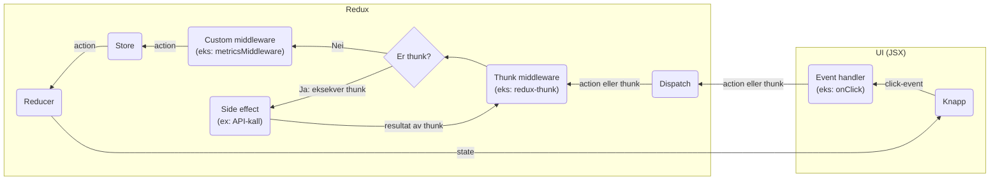

# Redux terminologi mm.

## Store

En **store** er i bunn og grunn et JavaScript-objekt som holder på appen sin tilstand. Også kjent som **app state**, **
global state**, **redux store**, osv.

Tilstand som man ønsker å ha globalt tilgjengelig i appen legges i **store**-en. For å gjøre endringer i tilstanden
kringkaster appen **action**-er som plukkes opp av **reducer**-e. For å lese fra **store**-en brukes typisk **selector**
-er.

## Action

En **action** beskriver en hendelse i applikasjonen. Den består av et JavaScript-objekt som inneholder minimum en
property `type` (navnet på action-en). I tillegg kan objektet inneholde andre properties typisk bestående av noe data.
Konvensjonen er å putte denne typen tilleggsinformasjon i en property kalt `payload`.

For å faktisk kringkaste en action brukes en Redux-spesifikk funksjon kalt `dispatch`. Enkelt forklart vil `dispatch`
sikre at **action**-objektet blir sendt til riktig(e) **reducer**(e).

## Reducer

En **reducer** er en spesiell type funksjon som tar inn **state** og **action** og returnerer ny tilstand. Sagt på en
annen måte er det i **reducer**-e man reagerer på **action**-er og oppdaterer tilstanden i **store**-en.

## Middleware

En **middleware** er en spesiell type funksjon som gir oss muligheten til å utføre sideeffekter uten å bryte med Redux
sin modell som i utgangspunktet ikke tillater sideeffekter. Eksempler på sideeffekter er logging og API-kall.

En **middleware** ligger mellom **dispatch** og **reducer** og har således tilgang til å se på alle **action**-er som
blir sendt før de når **reducer**-ene.

Eventuelle **middleware**-funksjoner kan kjøres sekvensielt, som vil si at dersom man f.eks. har to **
middleware** `middlewareEn` og `middlewareTo` kan man sende en **action** til `middlewareEn` først. `middlewareEn` kan
deretter
prosessere **action**-en og sende den videre til `middlewareTo`, før **action**-en til slutt sendes til **reducer**-en.

## Redux "Thunk" Middleware / Thunk

En **thunk** er en Redux-spesifikk middleware som lar oss utføre asynkrone operasjoner i Redux.

**Thunk**-middlewaren inspiserer bare **thunk**-funksjoner, som vil si at man må sende en spesiell funksjon
via. `dispatch`, i stedet for et ordinært `action`-objekt. Funksjonssignaturen forventes å være en funksjon som
aksepterer to argumenter `dispatch` og `getState`. Inne i selve **thunk**-funksjonen kan man kringaste videre eventuelle
nye **action**-er.

**Thunk**-middlewaren kan typisk brukes til å f.eks. utføre API-kall ved at man definerer en **thunk**-funksjon som
utfører et API-kall og, basert på resultatet av API-kallet, kringkaster **action**-er, f.eks. en `SUKSESS`-action om det
gikk bra eller en `FEIL`-action om det ikke gikk bra.

## Dataflyt (diagram)

